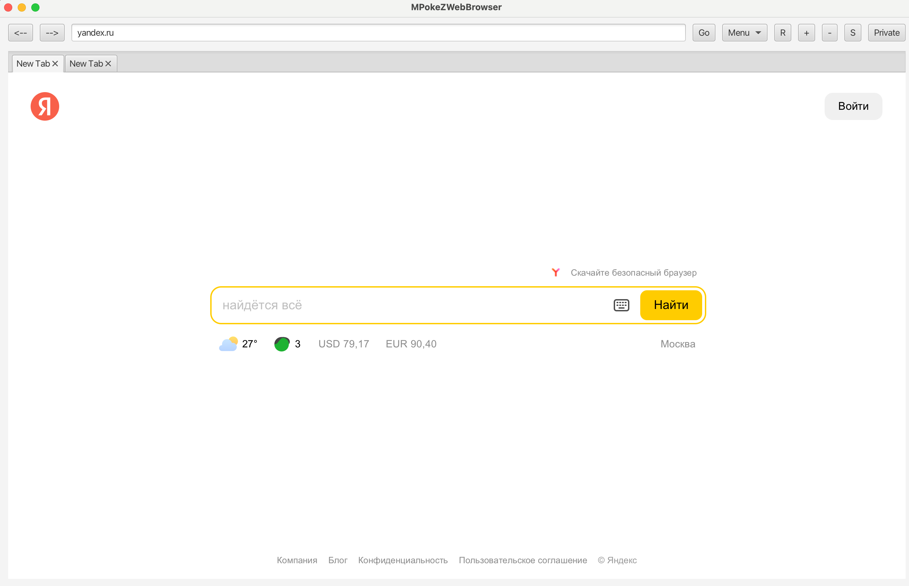
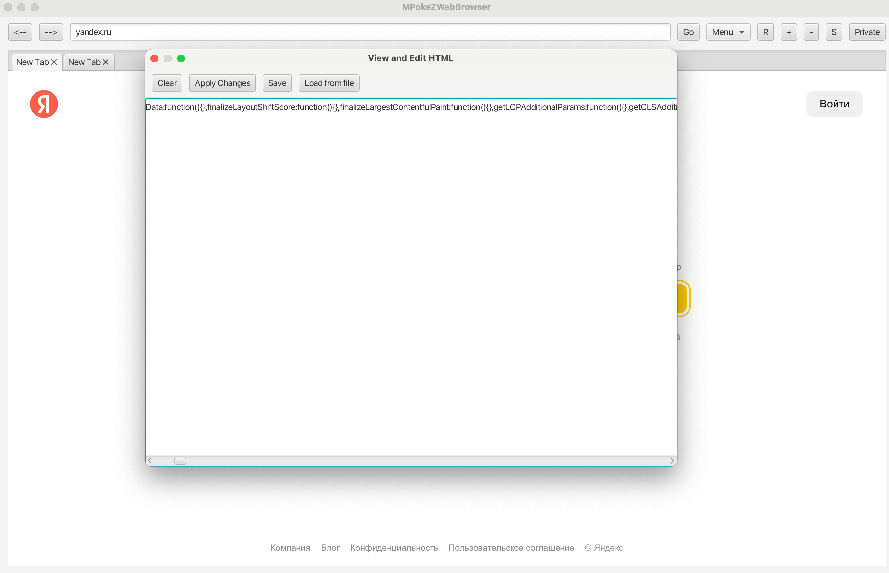
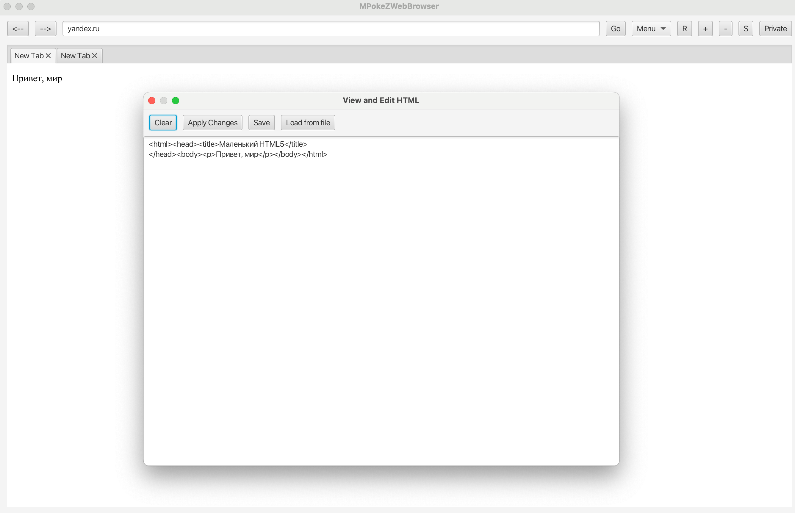
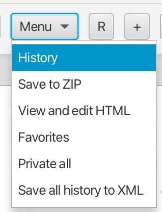
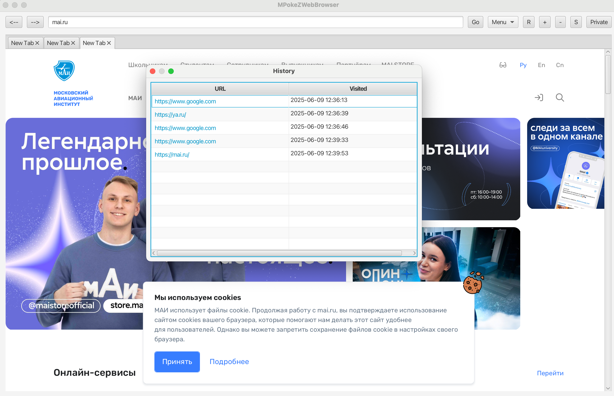

# Мини-браузер с поддержкой истории, вкладок и offline-режима

## Описание проекта

Кроссплатформенное десктопное приложение — мини-браузер с расширенным функционалом: просмотр HTML-страниц онлайн через HTTP, редактирование HTML, сохранение и сжатие страниц, система вкладок и управление историей посещений.

## Основной функционал

- **Просмотр HTML-страниц по URL (HTTP)**
- **История посещений** с датами, временем и продолжительностью (сохраняется в JSON/XML)
- Возможность **отключения истории** для всех или определённых сайтов
- **Сохранение и сжатие HTML-страниц** в ZIP-архив
- **Редактирование HTML-кода** просматриваемой страницы в соседнем окне
- **Система вкладок** с параллельной загрузкой контента
- **Создание собственных HTML-страниц**, их редактирование и сохранение
- **Добавление сайтов в “Избранное”**
- **Навигация по истории**: кнопки "Назад", "Вперёд", "Обновить"
- Поле для **ввода полного адреса сайта**
- **Графический пользовательский интерфейс**

## Технологии

- Язык: Java
- GUI: JavaFX
- Работа с HTTP: `HttpURLConnection`
- Хранение истории: JSON и XML
- Сжатие файлов: стандартный Java ZIP API
- Многопоточность: для параллельной загрузки вкладок

## Запуск
```bash
mvn javafx:run
```

## Скриншоты







